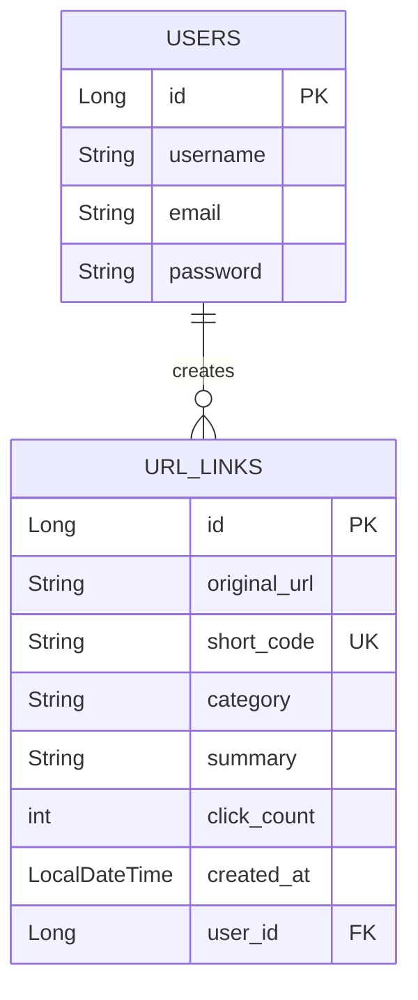

# URL Kısaltma Sistemi E-R Diyagramı

Aşağıdaki E-R (Entity-Relationship) diyagramı uygulamanın güncel veritabanı şemasını göstermektedir:

Açıklamalar:
- **URL_LINKS** tablosu oluşturulan kısa kodları, orijinal url adreslerini, tıklanma sayılarını ve AI servisi tarafından üretilen analizleri (summary, category) tutar.
- **USERS** tablosu kullanıcı hesapları için ayrılmıştır ve linklerle One-To-Many ilişkisine sahiptir.
